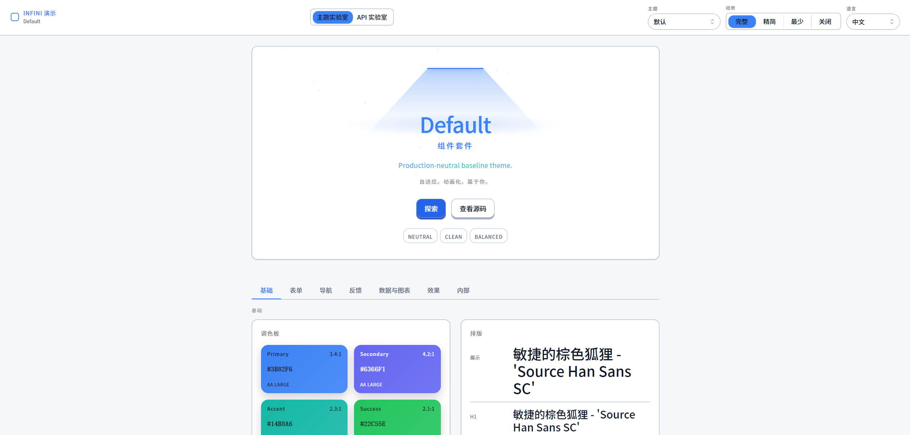

# Infini Demo

**中文** | [English](./README_en.md)

`Infini-Demo` 是 `Infini-Dev-Kit` 的交互式演示应用，用来集中展示主题系统、共享组件、动效层与 API 实验台。

默认文档语言：中文。

> AI 代理先读 [`AGENTS.md`](./AGENTS.md)。

## 预览

| 主题实验室 · Default | 主题实验室 · Cyberpunk | API 实验室 |
| --- | --- | --- |
|  |  |  |

## 这个仓库用来做什么

`Infini-Demo` 现在主要包含两个页面：

- `ThemeLab`
  用来检查主题、字体、颜色、按钮、数据展示、布局、视觉效果与内部 token 是否按预期工作。
- `ApiLab`
  用来演示 `createApiClient()` 的请求、错误处理、日志追踪与 MSW 模拟接口响应。

截图与 README 一样，默认都使用中文界面。

## 技术栈

- React 19
- TypeScript 5.9
- Vite 7
- Motion 12
- ECharts 6
- MSW 2
- 本地工作区依赖 `@infini-dev-kit/*`

## 快速开始

前提：

- Node.js 20+
- pnpm 10+
- 同级目录已经存在 `Infini-Dev-Kit`

目录示意：

```text
GitHub/
├── Infini-Dev-Kit/
└── Infini-Demo/
```

启动步骤：

```bash
cd Infini-Demo
pnpm install
pnpm dev
```

默认开发地址：

```text
http://localhost:5173
```

## 常用命令

```bash
pnpm dev
pnpm typecheck
pnpm build
pnpm preview
```

## 仓库结构

```text
src/
├── App.tsx
├── main.tsx
├── components/
├── i18n/
├── mocks/
├── pages/
│   ├── ApiLab.tsx
│   └── theme-lab/
├── providers/
└── theme/
```

## 你能在这里看到什么

- 主题切换：
  `default`、`chibi`、`cyberpunk`、`neu-brutalism`、`black-gold`、`red-gold`
- 动效等级切换：
  `off`、`minimum`、`reduced`、`full`
- 中文界面下的主题字体与 token 生效情况
- 按钮基底与组合效果
- API 请求日志、错误响应与覆盖率演示

## 与 Dev Kit 的关系

这个仓库是 `Infini-Dev-Kit` 的消费端与验证场，不应该复制 Dev Kit 内的主题逻辑、组件实现或工具函数。需要改共享能力时，优先回到 `Infini-Dev-Kit` 修改，再回这里验证。

## 截图资源

README 中使用的截图位于：

- [`docs/images/theme-lab-default-zh.png`](./docs/images/theme-lab-default-zh.png)
- [`docs/images/theme-lab-cyberpunk-zh.png`](./docs/images/theme-lab-cyberpunk-zh.png)
- [`docs/images/api-lab-zh.png`](./docs/images/api-lab-zh.png)

## 许可证

[MIT](./LICENSE)
